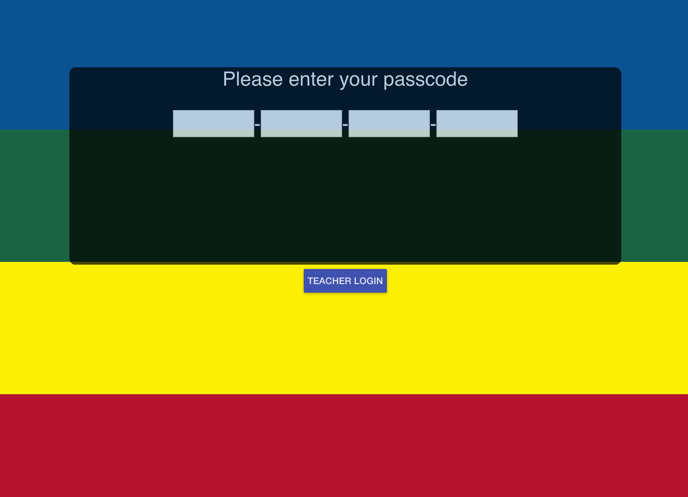
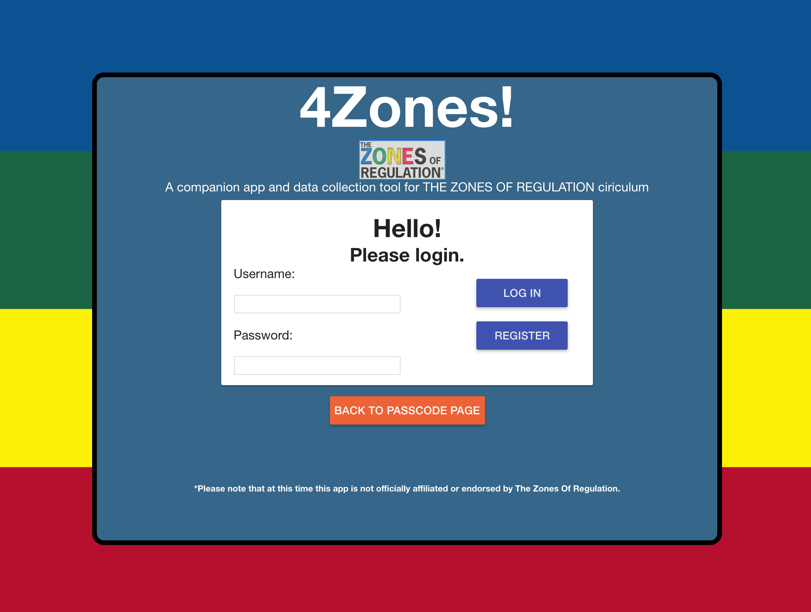
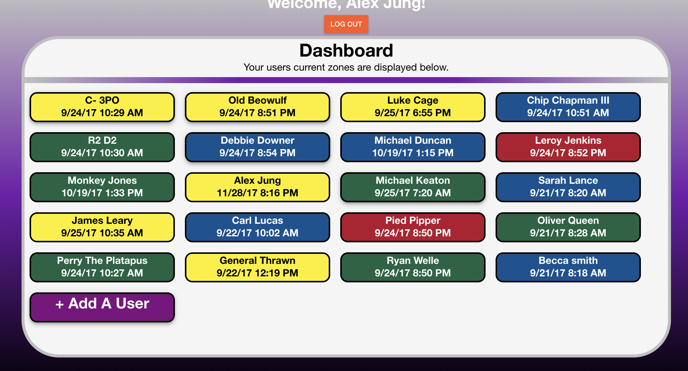

# 4Zones

A companion app to the Zones of Regulation emotional ciriculum that specializes in collecting data for case managers.
Hosted live here: https://four-zones.herokuapp.com/
Teacher Login:
  Username: Admin
  Password: test
User Login:
  Pin: q q q q

## Built With

HTML 5
CSS 3
AngularJS
Express
Node.js
PostgreSQL

## Getting Started

### Prerequisites

Link to software that is required to install the app (e.g. node).

- [Node.js](https://nodejs.org/en/)
- [postgreSQL](https://www.postgresql.org/)


### Installing

To run a local copy:

- Clone a copy down.

- Data base setup
In your SQL manager(I used Postico 2 ) enter the commands below. 

```sql
CREATE TABLE logs (
    pin VARCHAR(4),
    created_at TIMESTAMP WITH TIME ZONE DEFAULT CURRENT_TIMESTAMP,
    zone VARCHAR(5),
    Emotion VARCHAR(24),
    CAUSE VARCHAR(1000),
    RESPONSE VARCHAR(1000),
    NOTES VARCHAR (2000)
);

CREATE TABLE users(
id unique,
username VARCHAR(80),
password VARCHAR(40),
first_name VARCHAR(20),
last_name VARCHAR(40),
email VARCHAR(80)
);


Create TABLE participant(
id serial primary key,
first_name VARCHAR(20),
last_name VARCHAR(40),
responder VARCHAR(80),
level VARCHAR(10) not null,
pin VARCHAR(4) not null unique,
LoggedIn boolean default True,
supervisor VARCHAR(40)
);
```

- enter NPM install in your CLI

## Screen Shot

Include one or two screen shots of your project here (optional). Remove if unused.
Home Page:

Admin Login:

Teacher Splash Page:


## Documentation

[Original scope document:](screenshots-docs/Solo Project Work Template.pdf)

### Completed Features

High level list of items completed.

- [x] Students can login in with a simple passcode
- [x] Students can enter emotions and all buttons work
- [x] Teachers can login and create users
- [x] Teachers can see all thier assigned students colors at a glance
- [x] Teachers can see all of a students entries 

### Next Steps

Features to add as time permits.

- [ ] Limit visible students to only those assigned to the admin.
- [ ] Get node mailer functionallity working.
- [ ] Move the curser from one box to the next in the passcode page.
- [ ] Updating student info.
- [ ] Adding filters for the history table.
- [ ] Modifying functionality based on student emotional awareness.
- [ ] Adding animations to the student view.
- [ ] Adding an admin level.
- [ ] Adding a registration key.
- [ ] Adding node mailer functions.
- [ ] Adding pattern recognition and data analytics.
- [ ] Adding data visualization.
- [ ] Make Teacher splash page auto renew. 

## Authors

* Alex Jung (developer)

## Acknowledgments

* Charly Renk for reminding me what an M.V.P. is.
* Samantha Jung, my wife and client who had the idea and created user testing oppurtunities.